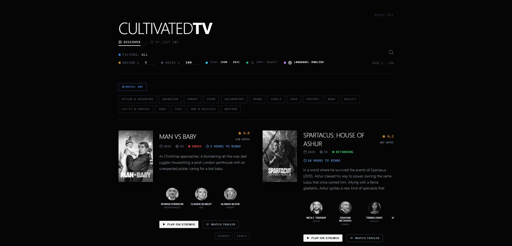

# CABINET

**A TV series discovery journal.**

> *"Not a streaming service. A reading room with screens."*

---

## What changed

This repository began life as **Cultivated TV**, a dark "noir" discovery dashboard. It has
been rebuilt as **Cabinet**: the same discovery engine underneath, but the interface is now
set like a printed film quarterly — aged paper, walnut ink, three typefaces, and no
algorithm-shaped furniture.

Everything the old app could do, it still does: the TMDb-powered index, include/exclude
genre filtering, multi-language include/exclude, the era slider, binge-liability maths,
Stremio deep links and the local watchlist. What is new is how it reads.



*The screenshot above is the previous build. It is kept for history, not as a picture of
Cabinet.*

---

## The departments

The page is one continuous issue, numbered in roman:

| | Department | What it is |
|---|---|---|
| **I** | **In Rotation** | Your shelf, as notebook entries, with the backlog costed in hours. |
| **II** | **The Index** | The full filtered index, readable as *leaflets* or *notebook entries*. |
| **III** | **Editor's Desk** | The standing essay. Written, not generated. |
| **IV** | **Late Night, Loud Volume** | Four mood collections. Each one writes real filter state. |
| **V** | **Colophon** | How the seals are derived, what the types are, where the data comes from. |

**The Clock** — a cinema-ticket stub in the corner of the page — appears once something is
shelved. It carries the title, the season and episode you are on, and the time remaining.
There is no player here, so episodes are marked off by hand and kept in local storage.

---

## Design system

**Palette.** Aged paper and ink, low-chroma, no blue.

| Token | Hex | Use |
|---|---|---|
| `--ink` | `#1A1612` | Deep walnut. All primary type. |
| `--paper` | `#F2EBDD` | Aged cream. The page. |
| `--paper-2` | `#E8DFC9` | Layered surfaces, filter desk, ticket. |
| `--cloth` | `#C9B79C` | Linen cover tone. |
| `--rust` | `#B5482A` | Oxide red — the single accent of warmth. |
| `--rust-deep` | `#9C3A20` | Oxide red at caption sizes, where `--rust` would fail AA. |
| `--moss` | `#4A5240` | Aged green, secondary accent. |
| `--gold` / `--gold-deep` | `#B8893E` / `#8A6428` | Seals and ornament; the deeper value for lettering. |
| `--rule` | `#2A221B` | Hairline rules. |

**Type.** `Fraunces` (display, with its `SOFT` and `WONK` axes carrying the hand-drawn
wobble), `Inter` (running text), `JetBrains Mono` (marginalia, ledger figures, catalogue
numbers). Headlines are set tight at −0.02em; small caps labels at +0.18em.

**Texture.** Procedural SVG grain at 0.04 opacity, ink rules with a half-pixel bleed,
hand-drawn underlines drawn in CSS, drop caps, seals tilted −4°, and slightly crooked
frames — no photographic texture assets anywhere.

**Motion.** One curve for the whole journal: `cubic-bezier(0.2, 0.7, 0.1, 1)`. The hero
fades over 300ms and rises 12px across 600ms. Card hovers warm the sepia plate by five
percent, lift the caption 2px and draw the underline. `prefers-reduced-motion` turns all
of it off.

**Accessibility.** Every string clears WCAG AA against the paper it sits on — measured, not
assumed. Focus is a 2px ink outline at 2px offset and is never removed. Decorative SVG and
ornament are `aria-hidden`. There are no star ratings, no rating bars and no match
percentages; TMDb's vote average is printed small and grey, the way an archivist prints an
accession number.

---

## The seals

The stamps are derived, never invented. Each one restates data TMDb already returned:

| Seal | Derived from |
|---|---|
| **New season** | `Returning Series`, last aired within 14 months |
| **Season finale** | `Ended`, last aired within 12 months |
| **Masterpiece** | rated ≥ 8.2 on ≥ 500 votes |
| **Overlooked** | rated ≥ 7.4 on < 250 votes |
| **New** | first aired this year |
| **Complete** | `Ended` |
| **Short form** | ≤ 6 hours, start to finish |

---

## Privacy & BYOK

Client-side only. Your TMDb key is stored in your browser and sent to TMDb alone — never
to a server of ours. Your shelf and episode marks live in `localStorage`.

[Get a free TMDb API key](https://www.themoviedb.org/settings/api), or read a sample issue
on the shared demo key.

---

## Running it

```bash
npm install
npm run dev      # dev server on 0.0.0.0:5173
npm run build    # tsc + vite build
npm test         # vitest run
```

## Tests

`npm test` mounts the real `App` against a mocked archive and exercises the actual request
path — `discoverShows`, the detail fetch, the seal derivation, the shelf, the clock's
episode maths, the genre three-state cycle, the collection presets and the landmark
structure. No component logic is duplicated in the tests.

## Stack

React 18 · Vite · Tailwind (extended with the Cabinet tokens) · TypeScript · TMDb v3 ·
Vitest + Testing Library.

---

## What we are not

- Not Netflix, Disney+ or Mubi in look or feel.
- No purple, no indigo, no AI-gradient backgrounds.
- No glass morphism, no neumorphism, no pill-shaped buttons.
- Not everything is centred.
- Nothing animates for the sake of animating.
- No emoji as UI icons — a handful appear as editorial marginalia, and that is all.
- No fake user reviews, no rating bars, no "98% match".
